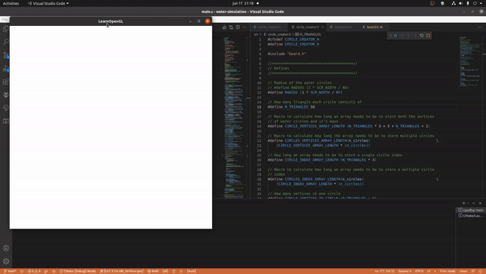

# Water simulation

This is a 2D falling water simulation. It is all done in c using OpenGL.



## Instructions

0. Install [glfw](https://www.glfw.org/) and [glad](https://glad.dav1d.de/)
1. Clone the repo.
2. cd into the build directory
3. Build the code via: ```cmake && cmake --build .```
4. Run the code via ```./main```, while still in build directory
5. Use ```1, 2 and 3``` and the mouse to place blocks. Press ```a``` to start simulation, ```d``` to stop it and ```r+enter``` to restart.
